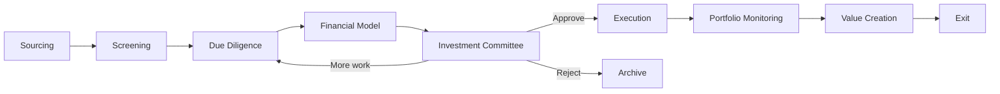

# Investment Lifecycle

## Decision gates
- Screening: strategic fit?
- Diligence: thesis validated and risks understood?
- IC: risk-adjusted return attractive enough to deploy capital?
- Portfolio review: actual performance consistent with thesis?
- Exit: hold, recapitalize, or monetize?
