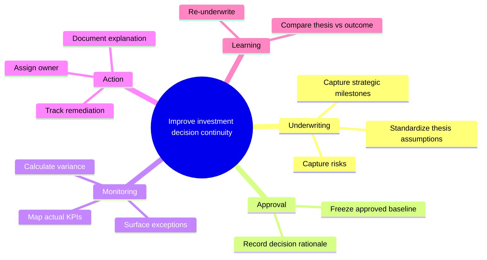

# Opportunity Map

```mermaid
mindmap
  root((Improve investment decision continuity))
    Underwriting
      Standardize thesis assumptions
      Capture risks
      Capture strategic milestones
    Approval
      Freeze approved baseline
      Record decision rationale
    Monitoring
      Map actual KPIs
      Calculate variance
      Surface exceptions
    Action
      Assign owner
      Document explanation
      Track remediation
    Learning
      Re-underwrite
      Compare thesis vs outcome
```
