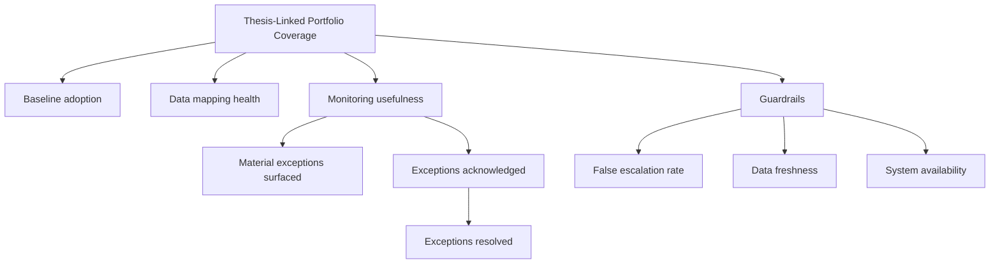

# Metric Tree

## Supporting metrics
- Baseline adoption %
- KPI mapping success %
- Data freshness %
- Exception acknowledgment time
- Exception resolution time
- False escalation rate
- Monthly active portfolio managers
