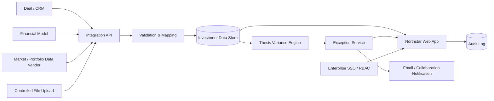

# System Architecture

```mermaid
flowchart LR
CRM[Deal / CRM] --> API[Integration API]
MODEL[Financial Model] --> API
VENDOR[Market / Portfolio Data Vendor] --> API
CSV[Controlled File Upload] --> API
API --> VALID[Validation & Mapping]
VALID --> STORE[(Investment Data Store)]
STORE --> ENGINE[Thesis Variance Engine]
ENGINE --> EXC[Exception Service]
STORE --> APP[Northstar Web App]
EXC --> APP
EXC --> NOTIFY[Email / Collaboration Notification]
APP --> AUDIT[(Audit Log)]
SSO[Enterprise SSO / RBAC] --> APP
```

## Design intent
Northstar acts as a workflow/intelligence layer. It integrates with existing systems rather than replacing every source platform.
